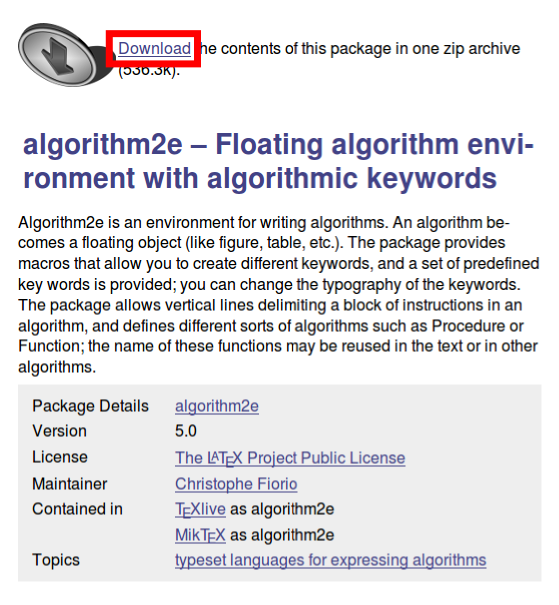
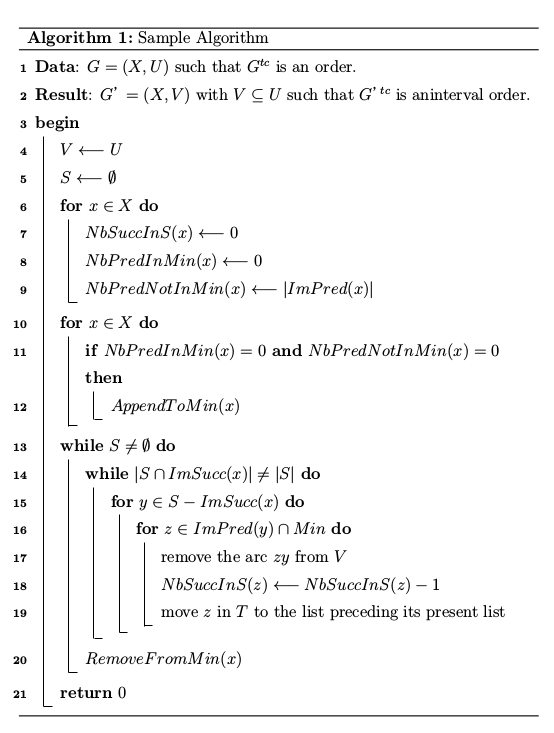

#algorithm2eを使った擬似コードの作成
##サイトから必要なファイルを取ってくる
###algorithm2e.styを入手
algorithm2e.zipに使い方やサンプルも中に入ってる．  
[http://www.ctan.org/tex-archive/macros/latex/contrib/algorithm2e](http://www.ctan.org/tex-archive/macros/latex/contrib/algorithm2e)  
**注意**：TeXインストールの環境にもよるが，どうやらalgorithm2e.styは最初っから導入されていることが多い？  
errorがでたら導入されてないから，algorithm2e.sty持ってきて．  

  

###jdummy.defを入手
[http://shimizus.hustle.ne.jp/wiki/wiki.cgi?page=Font+shape+undefined%A5%A8%A5%E9%A1%BC%C2%D0%BD%E8](http://shimizus.hustle.ne.jp/wiki/wiki.cgi?page=Font+shape+undefined%A5%A8%A5%E9%A1%BC%C2%D0%BD%E8)  
これがないと，Sublime TextのLaTeXToolsを使った環境では，以下のWarningが  

```bash
./algorithm2e_test.tex:30: LaTeX Font Warning: Font shape `JT2/gt/m/it'    undefined(Font) using `JT2/gt/m/n' instead on input line 30.
./algorithm2e_test.tex:30: LaTeX Font Warning: Font shape `JY2/gt/m/it'    undefined(Font) using `JY2/gt/m/n' instead on input line 30.
./algorithm2e_test.tex: LaTeX Font Warning: Some font shapes were not available, defaults substituted.
```

このサイトのエラーでは`JY1/gt/m/i`が〜って言っているが，こちらでは`JY2`と`JT2`なのでダウンロードしてきた`jdummy.def`の中の，`JY1`と`JT1`の記述をそれぞれ`JY2`と`JT2`に全部置換．これでうまくいった．  
どうやらコンパイル環境によって、紹介したブログのように`JY1`，`JT1`についてWarningが出てるらしい，この場合は置換する必要なし．  

##実際にコンパイルしてみる

```tex
\usepackage[ruled,vlined]{algorithm2e}
\usepackage{setspace}
\input{jdummy.def}
```

* これらを記述しておく．`\usepackage[ここにレイアウトのオプション]{algorithm2e}`の`[]`はオプションを書くところ．`algorithm2e.sty`が入っていたzipのドキュメントを見る．  
* `\usepackage{setspace}`は擬似コードの行間を調整するためのやつ．  
* `\input{jdummy.def}`はフォントが見つからない対策用．  

```tex
\begin{algorithm}
\caption{Sample Algorithm}
\label{Sample}
\setstretch{1.2} %ここの数値で行間を調整
\DontPrintSemicolon %この行を消すと文末にセミコロンがつくよ．
\nl\KwData{$G=(X,U)$ such that $G^{tc}$ is an order.} %頭に\lnをつけるとその行に番号がつく
\nl\KwResult{$G’=(X,V)$ with $V\subseteq U$ such that $G’^{tc}$ is aninterval order.}
\nl\Begin{
  \nl$V \longleftarrow U$\;
  \nl$S \longleftarrow \emptyset$\;
  \nl\For{$x\in X$}{
  \nl$NbSuccInS(x) \longleftarrow 0$\;
  \nl$NbPredInMin(x) \longleftarrow 0$\;
  \nl$NbPredNotInMin(x) \longleftarrow |ImPred(x)|$\;
  }
  \nl\For{$x \in X$}{
    \nl\If{$NbPredInMin(x) = 0$ {\bf and} $NbPredNotInMin(x) = 0$}{
      \nl$AppendToMin(x)$
    }
  }
  \nl\While{$S \neq \emptyset$}{
    \nl\While{$|S \cap ImSucc(x)| \neq |S|$}{
      \nl\For{$ y \in S-ImSucc(x)$}{
        \nl\For{$z \in ImPred(y) \cap Min$}{
          \nl remove the arc $zy$ from $V$\;
          \nl$NbSuccInS(z) \longleftarrow NbSuccInS(z) - 1$\;
          \nl move $z$ in $T$ to the list preceding its present list\;
        }
      }
    }
    \nl$RemoveFromMin(x)$\;
  }
}
\end{algorithm}
```

コンパイルに成功すると以下の写真みたいになる．  

  